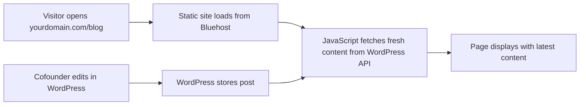

# Bluehost Deployment Guide for Senior Tech Connect

## Overview
This guide covers deploying your Next.js blog to Bluehost hosting so your cofounder can view the blog online while editing in WordPress.

## 🎯 Recommended Approach: Static Export + WordPress Sync

Since your bidirectional sync works perfectly, we'll deploy a static version of your blog that loads content directly from WordPress via your custom API.

### Why This Works Well:
- ✅ Your cofounder edits in WordPress admin
- ✅ Blog displays beautifully on your Bluehost domain
- ✅ Content loads fresh from WordPress each page load
- ✅ No server-side hosting complications
- ✅ Fast, reliable, and cost-effective

## 📋 Step-by-Step Deployment

### Step 1: Prepare for Static Export

Your `next.config.js` is already configured for static export. Now update your build script:

Add to `package.json` scripts:
```json
{
  "scripts": {
    "build:static": "next build",
    "export": "next export"
  }
}
```

### Step 2: Build Your Static Site

```bash
npm run build:static
```

This creates an `out` folder with all your static files.

### Step 3: Upload to Bluehost

#### Option A: Bluehost File Manager
1. Login to your Bluehost control panel
2. Go to "File Manager"
3. Navigate to `public_html` (or your domain's folder)
4. Delete existing files (like default index.html)
5. Upload all contents from the `out` folder

#### Option B: FTP Upload
1. Use FileZilla or similar FTP client
2. Connect with your Bluehost FTP credentials
3. Navigate to `public_html`
4. Upload all files from the `out` folder

### Step 4: Configure WordPress CORS

Since your static site will make API calls to WordPress, add this to your WordPress `functions.php`:

```php
function add_cors_headers() {
    header("Access-Control-Allow-Origin: https://yourdomain.com");
    header("Access-Control-Allow-Methods: GET, POST, OPTIONS");
    header("Access-Control-Allow-Headers: Content-Type, Authorization");
}
add_action('init', 'add_cors_headers');
```

## 🔄 How the Sync Works with Static Export



**Key Benefits:**
- Content is always fresh from WordPress
- No need for manual sync after WordPress edits
- Fast loading with Bluehost CDN
- Your existing bidirectional sync still works for local development

## 📁 File Structure on Bluehost

After upload, your Bluehost directory will look like:
```
public_html/
├── index.html (Your homepage)
├── blog/
│   ├── index.html (Blog listing page)
│   └── [slug]/
│       └── index.html (Individual post pages)
├── about/
│   └── index.html
├── _next/ (CSS, JS, and assets)
└── other static files
```

## 🚀 Alternative: Full Next.js on Bluehost (Advanced)

If Bluehost supports Node.js applications:

### Requirements:
- Bluehost plan with Node.js support
- SSH access
- Ability to run `npm` commands

### Steps:
1. Upload source code via FTP/Git
2. SSH into server
3. Run `npm install`
4. Run `npm run build`
5. Start with `npm start`
6. Configure domain to point to Node.js app

**Note:** Most standard Bluehost plans don't support this. Check with Bluehost support first.

## 🎨 Cofounder Workflow

With static export deployment:

1. **Edit Posts**: WordPress admin → Create/edit posts
2. **View Blog**: Visit `https://yourdomain.com/blog`
3. **See Changes**: Content loads fresh from WordPress automatically
4. **Share Links**: Send direct links to posts

## ⚠️ Important Considerations

### Static Export Limitations:
- No server-side API routes (but you don't need them since WordPress handles the backend)
- Environment variables need to be build-time (not runtime)
- All pages pre-generated (good for performance)

### Environment Variables:
Since static export happens at build time, make sure your WordPress API URL is accessible:

```javascript
// In your code, use direct URLs instead of process.env at runtime
const WORDPRESS_API_URL = 'https://info.digitaltrailheads.com/wp-json/dt-sync/v1';
```

## 🔧 Build Process

1. **Local Development**: `npm run dev` (with sync)
2. **Content Updates**: Edit in WordPress admin
3. **Deploy Updates**: Run `npm run build:static` and upload `out` folder
4. **View Live**: Visit your Bluehost domain

## 📈 Performance Benefits

- **Fast Loading**: Static files serve quickly
- **Global CDN**: Bluehost CDN distribution
- **SEO Friendly**: All pages pre-rendered
- **Mobile Optimized**: Responsive design works perfectly

## 🎯 Perfect for Your Use Case

This setup gives your cofounder exactly what they want:
- ✅ Edit in familiar WordPress admin
- ✅ View beautiful blog formatting online
- ✅ No localhost required
- ✅ Professional domain (yourdomain.com)
- ✅ Fast, reliable hosting
- ✅ Content always up-to-date

## 🚀 Next Steps

1. **Build static version**: `npm run build:static`
2. **Upload to Bluehost**: Use File Manager or FTP
3. **Configure WordPress CORS**: Add header code
4. **Test live site**: Visit your domain
5. **Share with cofounder**: They can start editing!

Would you like me to help with any of these steps? 